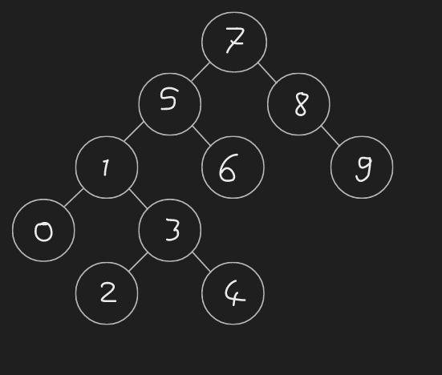

# Proje-3
### [7,5,1,8,3,6,0,9,4,2] -> Binary Search Tree

     1.Yukarı verilen dizinin Binary-Search-Tree aşamalarını yazınız.
     Örnek: root x'dir. root'un sağından y bulunur. Solunda z bulunur vb.

##### 1. Yukarı verilen dizinin Binary-Search-Tree aşamaları.

